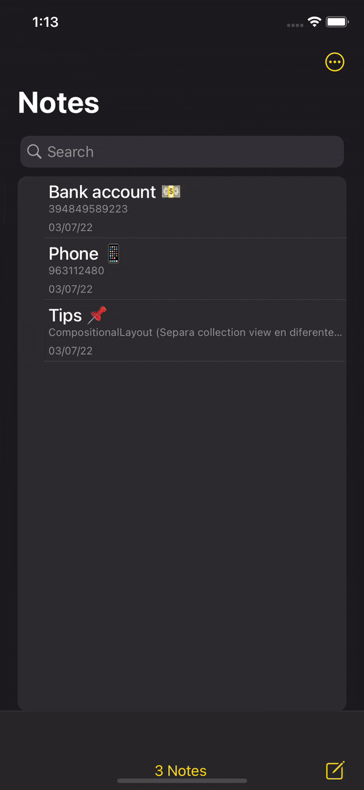
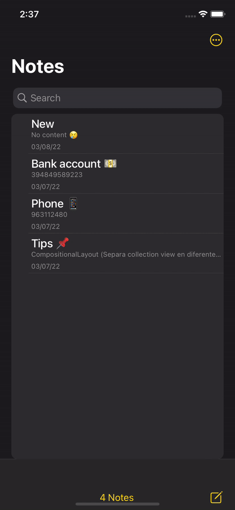
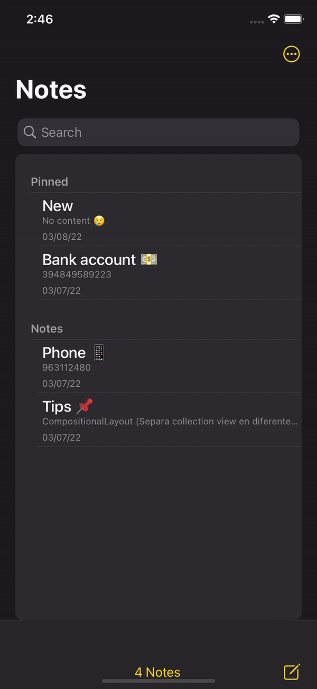

# NotesClone 📝
An iOS Notes Clone app made with UIKit. Take this project as a base for further implementations you may want to add. Feel free to make any PR or alert me of any crashes.
#### Features
- Storyboards (UI)
- Delegates (Events)
- UserDefaults (Local storage)
- Leadin/trailing table-view-cell swipe actions
- Custom swipable modal (as in the original NotesApp)

 

### Demos

| Create new Note | Edit Note | Delete Note | Search Note |
| --- | --- | --- | --- |
|  |  |  |  |

| Pin Note | Unpin Note | Custom Options View | Sharing Note |
| --- | --- | --- | --- |
|  |  |  | 

###### If this was of any help, a 🌟 would be highly appreciated!!
